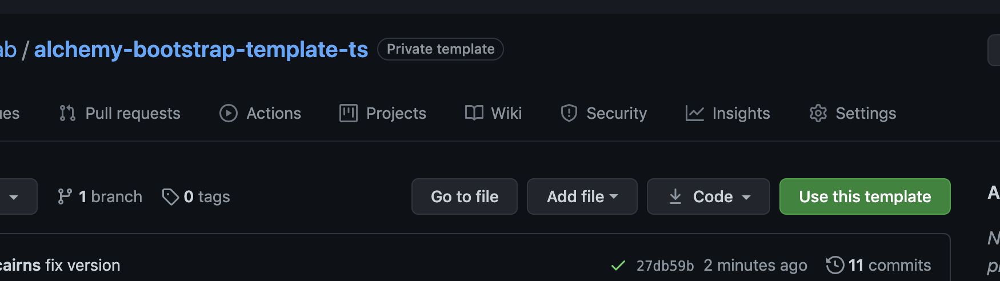
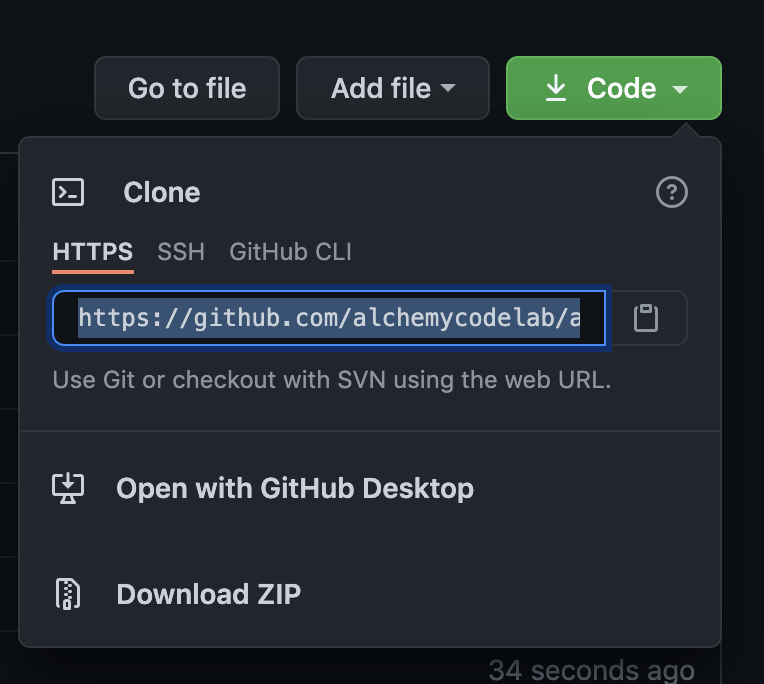

# alchemy-bootstrap-ts-template 

## Instructions

1) Click the friendly "Use this Template" button. Create a new repo name and click "Create repository from this template".

2) Now that you've made a new repo off of this template, click the friendly, green "Code" button. Click the clipboard icon to get your repo's URL.

3) In your terminal, `git clone your-copied-repo URL`

4) In your terminal, `cd your-project-name`

5) In your terminal, `npm i`

6) In your terminal, `code .` to open the text editor. If that doesn't work, do whatever you need to do to open this directory up in VSCode.

7) In your terminal, `npm start`. A tab should open in your browser. Change files in `src/index.html` and `src/index.ts` to live update this code.

_credit to Ben Waples for kicking this project off!  https://github.com/benwaples_